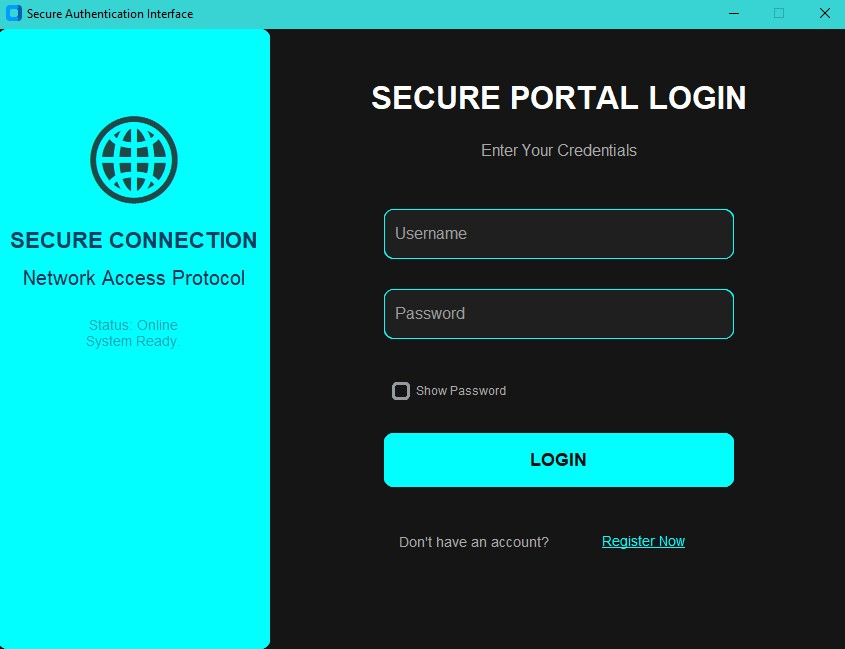

# 🔐 Multi-Layer Cryptographic Authentication System

A professional-grade secure portal built with **Python** and **CustomTkinter**. This project demonstrates a "Defense in Depth" strategy by using a 4-layer cryptographic pipeline to protect user credentials.

## 🖥️ User Interface Preview

### Login Portal


### User Registration


## 🛠 Features
* **4-Layer Security Pipeline:** Every password is processed through a sequential chain of SHA-512, DES, AES, and RSA.
* **Modern UI:** Sleek, dark-mode "Secure Portal" interface with an aqua-accent aesthetic.
* **Real-time Strength Meter:** Instant visual feedback on password complexity.
* **Self-Healing Setup:** Automatically generates cryptographic keys and the local vault file on the first run.


## ⚙️ How It Works (The Pipeline)
1. **SHA-512 Hashing:** The password is first hashed into a one-way digest.
2. **DES Encryption:** The hash is encrypted using Data Encryption Standard.
3. **AES Encryption:** A layer of AES is added for modern symmetric security.
4. **RSA Encryption:** The data is finally wrapped in an Asymmetric layer before being stored in the `user_vault.txt`.


## 🚀 How to Run

1. **Clone the repo:**
   
   ```bash
   git clone https://github.com/Fatemaa26/Multi-Layer-Auth-System.git
3. **Install dependencies:**
   
   ```bash
   pip install -r requirements.txt
5. **Launch the App:**
   
   ```bash
   python updated_authenticator_system.py
